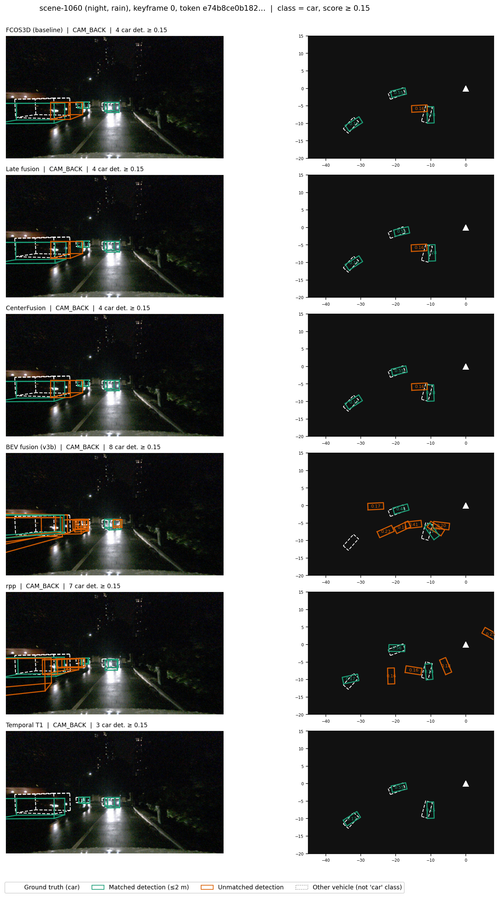

# Camera-Radar Fusion for 3D Object Detection

<p align="center">
  
</p>

<p align="center">
  <em>Best model pipeline built on a nuScenes validation scene.<br>
  Camera overlay (left) and BEV plot (right): ground truth in white, matched detections in green, radar returns in cyan.</em>
</p>

Camera-radar fusion for 3D object detection on nuScenes, comparing detection-level,
mid-level (BEV), and early-fusion designs against camera-only and radar-only
baselines under one shared radar preprocessing pipeline and evaluation protocol.
Developed as part of a Master's thesis.

Every trained/learned design is also checked with a shuffle ablation (permute a
modality's content, re-measure NDS) to confirm a reported gain actually comes from
radar rather than the optimiser routing around it.

## Report

Full write-up: [report/TFM_CCAM_Guzman.pdf](report/TFM_CCAM_Guzman.pdf).

## Results (full nuScenes validation split)

| Method | Fusion level | mAP | NDS |
|---|---|---|---|
| Radar-only baseline | Radar-only | 0.0004 | 0.0183 |
| FCOS3D | Camera-only baseline | 0.3212 | 0.3948 |
| Late fusion | Detection-level, deterministic (Hungarian match) | 0.3164 | 0.3904 |
| BEV fusion (v3b, frame-corrected) | Mid-level, shared BEV grid | 0.2444 | 0.3663 |
| CenterFusion + uncertainty gate | Detection-level, frozen camera | 0.3271 | 0.4115 |
| &nbsp;&nbsp;+ temporal post-processing (T1) | Post-processing on CenterFusion output | 0.3401 | 0.4336 |
| rpp (radar-primary early fusion) | Early, radar-first pillars | 0.1590 | 0.3344 |

### Qualitative example



All seven methods on the same night/rain keyframe (`scene-1060`), each shown as
camera overlay (left) and BEV plot (right): ground truth in white, matched
detections in green, unmatched in orange.

## Repository layout

- `scripts/` — training/eval/ablation/analysis entry points, grouped by purpose (see `scripts/README.md`)
- `configs/` — mmdet3d/mmengine configs for every model
- `models/` — custom detectors, backbones, and fusion modules registered with mmdet3d
- `datasets/` — custom nuScenes dataset and transforms (radar BEV loading, augmentations)
- `pipelines/` — end-to-end bash scripts wiring the above together

## Installation

**Requirements:** Python 3.10, NVIDIA GPU with CUDA 12.1, [uv](https://docs.astral.sh/uv/)

```bash
git clone https://github.com/guzgonav/camera-radar-3d-detection.git
cd camera-radar-3d-detection
./install.sh
```

Then activate the environment:

```bash
source .venv/bin/activate
```

`install.sh` sets up the Python environment and the MMDetection3D stack; it does
not download the nuScenes dataset. See [INSTALL.md](INSTALL.md) for the full
setup, including fetching and preparing the mini and full nuScenes splits.

## License

MIT, see [LICENSE](LICENSE).
