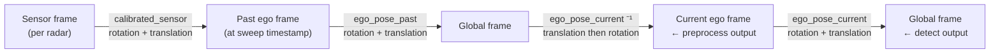

# scripts/

Radar preprocessing and detection pipeline for the camera-radar fusion project.

## Layout

| Folder | Contents |
|--------|----------|
| `radar/` | Radar point-cloud filtering, caching, and the radar-only baseline detector |
| `fusion/` | The three fusion methods (late, center, track/temporal) |
| `train/` | Training entry points (thin wrappers around mmdet3d's `tools/train.py`) |
| `eval/` | Evaluation / results-dumping wrappers, including the hard-scenes subset eval |
| `ablation/` | Shuffle and probe scripts for the load-bearing (radar shuffle) ablations |
| `analysis/` | Plotting and figure-generation scripts for the report |

---

## Data shapes

| Stage | Shape | Frame | Description |
|-------|-------|-------|-------------|
| Raw (one sensor) | `(18, N)` | Sensor | All 18 radar fields per point |
| After `filter_radar_points` | `(18, M)` where M ≤ N | Sensor | Invalid/clutter removed |
| After `accumulate_sweeps` | `(18, M×nsweeps)` | Ego | Past sweeps stacked, ego-compensated |
| After `get_radar_pointcloud` | `(6, M)` | Ego | 5 sensors merged, compact fields only |
| Detection dict | — | Global | nuScenes submission format |

The compact `(6, M)` array layout:

```
row 0  x        forward (m)
row 1  y        left (m)
row 2  z        up (m)
row 3  vx_comp  compensated velocity X (m/s)
row 4  vy_comp  compensated velocity Y (m/s)
row 5  rcs      radar cross section (dBsm)
```

---

## Coordinate frame chain



---

## Usage

```bash
# --- Radar-only baseline ---
bash pipelines/run_radar_baseline.sh          # mini val (default)
bash pipelines/run_radar_baseline.sh full     # full val

# Run radar detector directly with custom parameters
python scripts/radar/radar_detect.py \
    --version v1.0-mini \
    --dataroot data/nuscenes-mini \
    --split mini_val \
    --out results/radar_baseline/mini

# Smoke-test the preprocessing module alone
python scripts/radar/radar_preprocess.py

# --- Camera detection extraction ---
# Extracts FCOS3D predictions to nuScenes submission JSON (requires GPU)
bash pipelines/extract_camera_dets.sh         # mini val (default)
bash pipelines/extract_camera_dets.sh full    # full val

# --- Late fusion ---
# Step 1: extract camera detections (GPU required, skip if already done)
bash pipelines/extract_camera_dets.sh         # mini val (default)
bash pipelines/extract_camera_dets.sh full    # full val

# Step 2: run fusion + evaluation (no GPU needed)
python scripts/fusion/late_fusion.py \
    --cam-json results/fcos3d_baseline/mini/detections/pred_instances_3d/results_nusc.json \
    --out results/late_fusion/mini

# Full val split
python scripts/fusion/late_fusion.py \
    --version v1.0-trainval \
    --dataroot data/nuscenes \
    --split val \
    --cam-json results/fcos3d_baseline/full/detections/pred_instances_3d/results_nusc.json \
    --out results/late_fusion/full
```

---

## Files

| File | Role | Used by |
|------|------|---------|
| `radar/radar_preprocess.py` | Filtering + multi-sweep accumulation | `radar/radar_detect.py`, `fusion/late_fusion.py`, BEV fusion |
| `radar/radar_detect.py` | DBSCAN clustering + nuScenes evaluation | `pipelines/run_radar_baseline.sh` |
| `fusion/late_fusion.py` | Camera-radar late fusion via Hungarian matching | CLI — see Usage |

### Configs

| File | Role |
|------|------|
| `configs/fcos3d_mini.py` | FCOS3D inference config (mini) — runs eval, saves metrics only |
| `configs/fcos3d_full.py` | FCOS3D inference config (full) — runs eval, saves metrics only |
| `configs/fcos3d_mini_extract.py` | FCOS3D extraction config (mini) — saves raw detections as JSON |
| `configs/fcos3d_full_extract.py` | FCOS3D extraction config (full) — saves raw detections as JSON |

The `_extract` configs inherit from their base config and add `format_only=True` + `jsonfile_prefix`, which tells MMDetection3D to write per-sample detections in nuScenes submission format instead of computing metrics.

### Pipelines

| File | Role | GPU required |
|------|------|-------------|
| `pipelines/run_inference_mini.sh` | FCOS3D inference + eval (mini) | Yes |
| `pipelines/run_inference_full.sh` | FCOS3D inference + eval (full) | Yes |
| `pipelines/extract_camera_dets.sh` | FCOS3D detection extraction to JSON | Yes |
| `pipelines/run_radar_baseline.sh` | Radar-only detection + eval | No |
| `pipelines/extract_camera_dets.sh` + `scripts/fusion/late_fusion.py` | Late fusion (two-step) | Step 1: GPU, Step 2: No |
